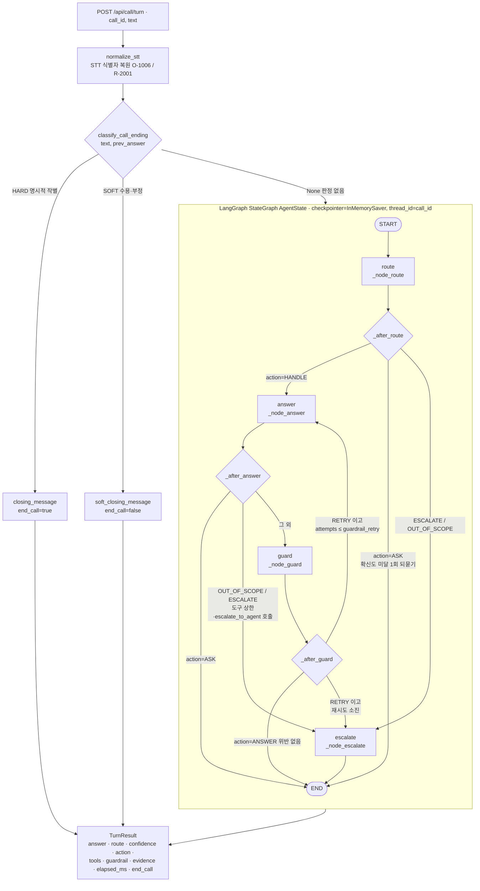
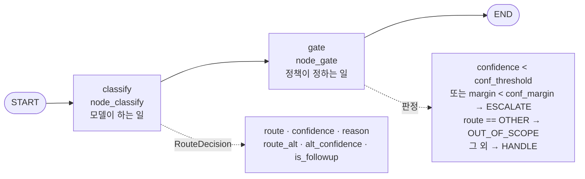
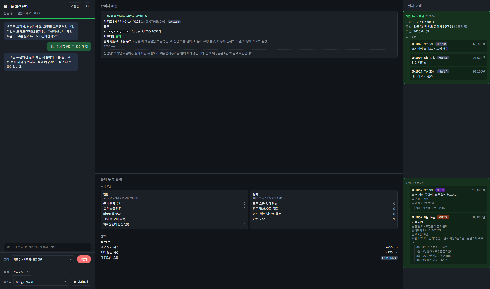
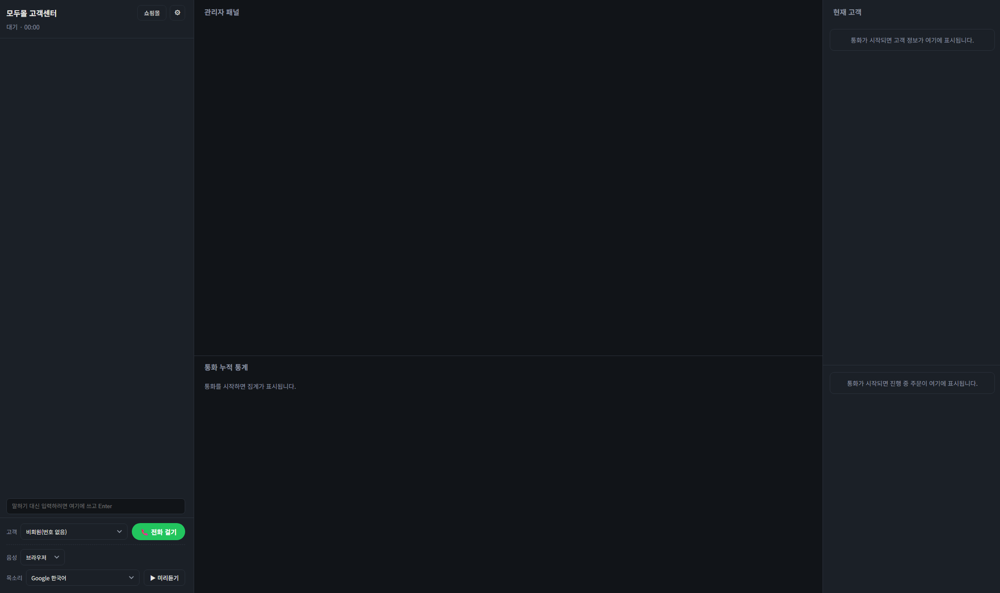
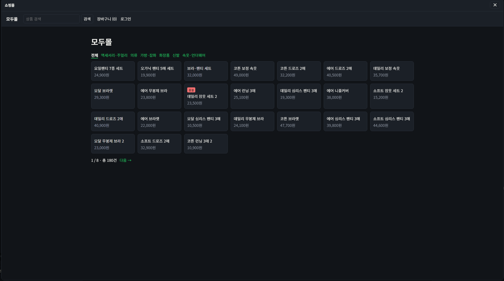

# REPORT — 음성 고객 응대 에이전트 (모두몰)

이 문서는 **무엇을 만들었는지**가 아니라 **어떤 판단을 왜 했는지**를 적는다.
실행 방법·배포·명령어·API 설명은 [`README.md`](README.md)에 있고 여기서 반복하지 않는다.

모든 수치에는 출처 문서 경로를 붙였다. 출처가 없는 수치는 쓰지 않았다.
저장소: 브랜치 `feat/voice-agent`. 라이브 데모: https://creating-a-customer-service-agent.onrender.com
(Render 무료 등급이라 유휴 후 첫 접속에 30~40초, 실제 통화는 방문자 본인의 OpenAI 키가 필요하다 — `README.md` "라이브 데모" 절)

---

## 1. 주제와 근거 문서

### 무엇을 골랐나

| 항목 | 값 |
|---|---|
| 주제 | 온라인 쇼핑몰 **모두몰**의 전화 고객 응대 (가상 도메인) |
| 근거 문서 | [`domains/modumall/policy.md`](domains/modumall/policy.md) — 「모두몰 고객상담 업무 매뉴얼」 CS-MN-001 v2.0, 시행일 2026-08-21 |
| 문서 규모 | 0~9장 + 부록 A·B. 적용 채널은 "웹·앱 문의하기, 채팅 상담 (온라인 전용 / 오프라인 매장 없음)" |
| 데이터 출처 | 전부 **합성**. `domains/modumall/eval/customer_inquiries.csv` 193건 모두 `provenance=합성`, `answer_goldenset.json`의 `provenance` 필드도 `"합성"` |
| 설계 근거 문서 | [`docs/superpowers/specs/2026-09-16-voice-customer-service-agent-design.md`](docs/superpowers/specs/2026-09-16-voice-customer-service-agent-design.md) |

`policy.md` 12~14행에 **가상 문서 고지**가 명시돼 있다 — "모두몰은 교육용으로 설정한 가상의
온라인 쇼핑몰이며, 본 문서는 실재하는 기업의 정책이 아닙니다."

### 왜 이 문서를 골랐나 — 문서 자체가 도구 호출의 경계를 그어 준다

이 과제의 핵심은 "매뉴얼에 근거한 답변"과 "건마다 달라져서 조회해야 하는 값"을 가르는 것이다.
보통은 이 경계를 설계자가 임의로 정해야 하는데, **이 매뉴얼은 그 경계를 문서 안에 이미 그어 두었다.**
`policy.md`의 「이 매뉴얼을 쓰는 방법」(16~33행)이 정보를 두 곳으로 나눈다.

| 어디를 보는가 | 무엇이 있는가 |
|---|---|
| **이 매뉴얼** | 전 상품·전 주문에 공통 적용되는 정책과 절차. 값이 바뀌면 개정 공지가 나간다. |
| **어드민(관리자 페이지)** | 상품·주문·고객별로 달라지는 값. 항상 어드민이 최신이다. |

그리고 후자에 해당하는 항목마다 본문에 **`[어드민 조회] 어드민 > 메뉴 경로`** 표시를 달아 뒀다.

이 표시가 그대로 설계의 두 축이 됐다.

1. **`[어드민 조회]` 표시가 붙은 항목 → 조회 도구로 뺐다.** `server/tools.py` 상단 docstring이
   그 의도를 그대로 적고 있다 — "어드민 조회 도구. 매뉴얼의 `[어드민 조회]` 표시에서 도출한 것들이다."
2. **표시가 없는 값(매뉴얼 본문에 숫자가 박힌 값) → 즉답을 허용했다.** 이 구분이 답변 프롬프트의
   절대 규칙 1·2(`server/prompts.py`의 `build_answer_rules`)와 가드레일의 `fixed_values`
   (`domains/modumall/domain.json`: 기본 배송비 2500, 반품 배송비 5000/2500, 출고 마감 11시 등)로
   이어진다.

매뉴얼 「0. 상담 기본 원칙」의 세 원칙도 그대로 시스템 규칙이 됐다 — 원칙 1 "매뉴얼에 있는 값만
즉답한다", 원칙 2 "주문 상태는 조회 없이 말하지 않는다", 원칙 3 "모르면 모른다고 하고 넘긴다"가
각각 가드레일 `VIOLATION_UNSOURCED`, `VIOLATION_NO_TOOL`, 라우터 게이트의 이관 분기에 대응한다.

### 정답셋을 합성으로 만든 이유

`answer_goldenset.json`의 `$comment`에 근거를 남겼다 — "원본 상담 데이터의 answer 컬럼은 서로
모순되고 사실오류가 있어 답변 정답으로 쓸 수 없으므로, 이 파일은 provenance=합성 이다. 질문 표현은
원본 데이터의 실제 발화 패턴을 참고했다." 즉 **질문은 실제 발화 패턴에서, 정답은 매뉴얼+목DB에서
결정되도록** 갈랐다. 정답이 문서로 결정되지 않는 대화는 애초에 저작하지 않았다.

---

## 2. 카테고리 설계

### 카테고리 목록과 그렇게 나눈 근거

라우트는 5개다 — 업무 4개 + 미분류 1개. 근거는 **매뉴얼 「1. 문의 유형 분류」가 이미 유형을 나눠
두었고, 각 유형에 담당 부서까지 적혀 있다는 점**이다. 카테고리를 내가 발명한 게 아니라 문서의
분류를 그대로 따랐다. `domains/modumall/domain.json`의 `routes[*].definition`에 그 담당 표기가
그대로 남아 있다("(담당: 주문)", "(담당: 배송)" 등).

카테고리를 4개로 잡은 실질적 기준은 **"답할 때 봐야 하는 매뉴얼 장이 서로 다른가"**이다.
배송 문의에 반품 배송비가 섞이면 오답을 유도하므로(`server/context.py` docstring),
장이 갈리는 지점이 곧 카테고리 경계다. `RETURN_REFUND`만 장 2개(5·6)를 묶은 이유도 같다 —
접수(5장)와 비용·처리(6장)는 문의 하나에서 거의 항상 같이 필요하다.

### 매핑표 — 각 카테고리를 문서의 어느 부분과 연결했는가

출처: `domains/modumall/domain.json`의 `routes[*].sections`·`always_sections`,
장 제목은 `domains/modumall/policy.md`의 `## ` 헤딩.

| 라우트 | 정의(domain.json) | 전용 근거 장 | 장 안의 절 |
|---|---|---|---|
| `ORDER_PLACE` | 구매·주문 접수, 구매 가능 여부, 수량·옵션 변경 요청 | `2. 주문·구매 문의` | 2.1 주문 접수 / 2.2 세트 상품의 개별 구매 / 2.3 주문 제작 상품 / 2.4 주문 변경 / 2.5 품절·단종 |
| `PRODUCT_INFO` | 상품 구성·품질·소재·사이즈·재고 문의 | `3. 상품 문의` | 3.1 상품 정보는 전부 화면에서 확인한다 / 3.2 사이즈 안내 / 3.3 정품·품질 보증 / 3.4 상세페이지 오류 |
| `SHIPPING` | 배송비, 배송 기간, 배송 조회, 무료배송 조건 | `4. 배송 문의` | 4.1 배송비 / 4.2 무료배송 기준 / 4.3 출고 마감 / 4.4 배송 소요기간 / 4.5 당일배송·퀵서비스 / 4.6 배송 조회 응대 순서 |
| `RETURN_REFUND` | 교환·반품·환불 신청 및 처리 현황 | `5. 교환·반품·환불 — 접수` `6. 교환·반품·환불 — 비용과 처리` | 5.1~5.4 (신청 기간·불가 조건·지정 택배사·접수 절차) / 6.1~6.5 (반품 배송비·처리 소요기간·3대 원칙·배송비 부담 판정·교환품 품절) |
| `OTHER` | 위 네 유형에 해당하지 않는 응대 범위 밖 문의 | **전용 장 없음** (`sections: []`) | — |

**모든 라우트에 공통으로 들어가는 장** (`always_sections`):
`이 매뉴얼을 쓰는 방법`, `0. 상담 기본 원칙`, `1. 문의 유형 분류`, `7. 응대 범위와 이관`, `8. 응대 태도와 문장`.

공통으로 뺀 기준은 "어느 라우트든 답변의 형식·한계를 결정하는 장"이다. 0장은 무엇을 즉답해도 되는지,
7장은 언제 손을 떼야 하는지, 8장은 어떻게 말할지를 정한다 — 라우트가 무엇이든 필요하다.

### 매핑이 실제로 다른 컨텍스트를 만드는지 확인

`server/context.py`의 `build_context(domain, route)`가 매뉴얼을 `## ` 헤딩 단위로 자르고
(`split_sections`) `always_sections + routes[route].sections`만 이어붙인다. 라우트별 결과
길이와 교차 오염 검사는 `README.md` "카테고리 설계와 근거 문서 매핑" 절에 실행 출력이 그대로 있다
(`SHIPPING`에 6.1 반품배송비 포함 `False`, `RETURN_REFUND`에 4.1 배송비 포함 `False`).

### 분류 기준을 매뉴얼과 따로 관리하지 않은 이유

라우터 프롬프트에 들어가는 `routing_rules`(domain.json)는 매뉴얼 `1.1 분류 판단 기준`·
`1.2 분류 우선순위`·`7.1 응대 범위 밖` 세 절의 발췌본이다. `server/prompts.py`의
`build_route_guide`가 `{domain.routing_rules}`를 그대로 끼워 넣는다. 매뉴얼이 개정되면 프롬프트도
같이 고쳐야 하는 한 쌍으로 묶어 둔 것이지, 별개 문서를 만든 것이 아니다.

### 매핑에서 빠진 것 — 사실 그대로

- **매뉴얼 9장 `자주 발생하는 실수`는 어떤 라우트의 `sections`에도, `always_sections`에도 없다.**
  즉 현재 어떤 프롬프트에도 주입되지 않는다. 의도인지 누락인지는 기록에 남아 있지 않아 확인이 안 된다.
  `domains/modumall/domain.json`의 `_note_manual_section_9` 키에 이 사실을 주석으로 남겨 뒀다.
- **부록 A·B는 설계상 제외**다. `server/context.py`의 `split_sections`가 제목이 "부록"으로 시작하는
  장을 건너뛴다(코드에 조건이 명시돼 있다).
- `OTHER`로 분류된 문의는 매뉴얼 장 대신 `server/pipeline.py`의 `_node_escalate`가 처리한다 —
  `action == "OUT_OF_SCOPE"`면 `out_of_scope_message`로 답하고 통화를 끊고, 그 외에는
  `escalate_message`로 상담원 이관을 안내한다.

### 도구와 카테고리의 관계

도구는 라우트별로 고정 배정하지 않았다. `server/tools.py`의 `make_tools`가 등록하는 도구는 10개
(`search_product`, `get_order_status`, `get_product_detail`, `get_product_options`,
`get_shipping_policy`, `get_return_policy`, `get_return_status`, `get_restock_info`,
`escalate_to_agent`, `find_customer`)이며 전 라우트에 동일하게 노출되고, 어떤 것을 부를지는
답변 프롬프트의 0~4단계 절차가 안내한다.

라우트별 **필수 도구 표**를 프롬프트에 박아 넣는 안을 실제로 시도했으나 **부정 결과라 되돌렸다**
(3차 강화 §2·§3: 기준선 21/32 → 표+자기점검 17/32 → 표만 15/32.
`docs/측정기록/2026-09-17 3차 강화 측정.md`). 카테고리별 도구 강제는 이 도메인에서 도움이 되지
않았다는 것이 측정 결과다.

> 참고: `README.md` 구조표의 "조회 도구 9개"는 `find_customer`가 추가되기 전 표기로 보인다.
> 현재 코드가 등록하는 것은 10개다(`server/tools.py`의 `make_tools` 반환 목록).

---

## 3. 평가셋 설계

### 몇 건을 어떻게 만들었나

| 평가셋 | 파일 | 건수 | 무엇을 재는가 |
|---|---|---|---|
| 라우팅 정답셋 | `domains/modumall/eval/routing_answers.csv` | 193행 = `eval` 120 + `fewshot` 40 + `outscope` 33 | 4클래스/5클래스 분류 정확도·macro F1·ECE |
| 문의 원문 | `domains/modumall/eval/customer_inquiries.csv` | 193건 (`provenance` 전부 합성) | 위 CSV의 `qa_id`가 참조하는 발화 본문 |
| 어려운 케이스 | `domains/modumall/eval/hard_cases.csv` | 72건 — 경계모호 15 · 극단단답 12 · 다중의도 12 · 분류체계밖 12 · 텍스트손상 12 · 문맥의존 9 | 되묻기 정책 비교, 확신도 임계값×마진 격자 |
| 답변 정답셋 | `domains/modumall/eval/answer_goldenset.json` | 34개 대화(그중 19개가 멀티턴), 자동 판정 대상 32건 | 도구 호출 적절성·답변 적절성 |
| 멀티턴 라우팅 | `domains/modumall/eval/multiturn_routes.json` | 20개 대화 / 43턴 | 라우트 드리프트, `followup` 판정 |
| 회귀 스위트 | `domains/modumall/eval/regression_cases.json` | 6건 (프롬프트 인젝션 3 + 없는 ID 3) | 고쳐도 다시 깨지면 안 되는 것 |

라우팅 정답셋은 4개 라우트를 **정확히 30건씩** 균등하게 잡았다(`eval` split). 클래스 불균형이 있으면
macro F1과 정확도가 엇갈려 해석이 어려워지기 때문이다. `OTHER`만 33건으로 따로 모았다.

### 기대 도구와 필수 사실을 무엇을 근거로 정했나

`answer_goldenset.json`의 `$comment`에 기준이 적혀 있다 — **"`policy_modumall.md` +
`mockdata_modumall.json` 으로 정답이 결정되는 대화만 저작했다."** 즉 기대값의 출처는 둘 중 하나여야 한다.

| 기대 필드 | 근거 |
|---|---|
| `expect.tools` | 매뉴얼에 `[어드민 조회]` 표시가 붙은 항목이면 그 항목을 가져오는 도구를 적었다 |
| `expect.must` | 매뉴얼 본문의 고정값(예: 기본 배송비 `2500`, 반품 신청 기한 `7`일, 출고 마감 `11`시) 또는 목 DB에서 결정되는 값(예: 신발 카테고리 무료배송 기준 `100000`) |
| `expect.forbid` | **조회 전에 말하면 안 되는 수치**. C-001이 대표적이다 — 상품을 특정하기 전에는 무료배송 기준액(`100000`·`40000`·`50000`…)을 말하면 실패다 |
| `expect.action` | 매뉴얼 절차상 되물어야 하는가(`ASK`)·조회 후 답하는가(`ANSWER`)·범위 밖인가(`OUT_OF_SCOPE`) |
| `expect.rubric`·`reference` | 사람이 읽을 판단 근거와 모범 답안. `reference`는 채점기 자기검증의 입력이 된다 |

`schema` 필드에 `action` 5종(`ASK`/`ANSWER`/`CONFIRM`/`OUT_OF_SCOPE`/`ESCALATE`)의 정의를
파일 안에 같이 넣어, 채점 기준이 코드가 아니라 데이터에 남도록 했다.

**34건 중 32건만 채점하는 이유**: `eval/eval_answer.py`의 `AUTO_ACTIONS = {"ANSWER", "ASK",
"OUT_OF_SCOPE"}`에 해당하는 것만 자동 판정한다. 제외되는 2건은 **C-007(`CONFIRM`)**과
**C-033(`ESCALATE`)**로, 고객 동의 절차나 이관 여부는 단일 턴 출력만으로 기계 판정하기 어렵다고
보고 뺐다. 이 2건은 "통과"로 세지도 "실패"로 세지도 않는다.

### 평가용과 예시용을 어떻게 갈랐나

`routing_answers.csv`의 `split` 컬럼이 셋으로 가른다.

| split | 건수 | 용도 |
|---|---|---|
| `eval` | 120 (4라우트 × 30) | **대표 지표 측정 전용.** 프롬프트에 절대 넣지 않는다 |
| `fewshot` | 40 (4라우트 × 10, `OTHER` 0건) | 프롬프트 예시용으로 **확보해 둔** 것 |
| `outscope` | 33 (전부 `OTHER`) | 5클래스 측정 전용(`--with-other` 옵트인) |

`eval/eval_router.py`가 `splits = ["eval", "outscope"] if args.with_other else ["eval"]`로
읽을 split을 고른다 — 평가 코드에서 split을 강제하므로 평가셋이 프롬프트에 새는 경로가 없다.

**그런데 `fewshot` 40건은 실제로 어디에도 쓰이지 않는다.** 저장소 전체에서
`routing_answers.csv`/`customer_inquiries.csv`를 읽는 코드는 `eval/eval_router.py`와
`eval/eval_context.py` 둘뿐이고 둘 다 평가용이다. 라우터가 실제로 보는 것은 `domain.json`의
정의·규칙 텍스트뿐이다(`server/router.py::make_llm_classifier` → `build_route_guide`).
근거: `docs/측정기록/2026-09-18 OTHER 포함 5클래스 라우팅 측정.md` §3 말미. 이 사실은 5클래스
측정 중에 확인됐다(7장 회고 참고).

### 채점 기준 자체의 타당성 검증

평가셋을 만들면 "채점기가 맞는가"라는 질문이 따라온다. 세 가지를 넣어 뒀다.

| 검증 | 코드 | 방식 |
|---|---|---|
| 규칙 채점기 자기검증 | `eval/scoring.py::self_check`, `self_check_split` | 모범 답안(`reference`)을 채점기에 넣어 전부 통과하는지 본다. 하나라도 실패하면 채점기가 틀린 것 |
| judge 자기검증 | `eval/judge.py::judge_self_check` | 모범 답안을 답변으로, `must` 전부를 누락 목록으로 넣어 judge가 전부 통과시키는지 본다. **실패 시 `eval_answer --judge` 실행 자체가 중단된다** |
| 확신도 보정 | `eval/calibration.py::calibration_table` (ECE) | "확신도가 높으면 실제로 잘 맞는가"를 구간별로 따로 검증 |

실제 실행에서 채점기 자기검증 34건 실패 0건, judge 자기검증 32건 실패 0건이 확인됐다
(`docs/측정기록/2026-09-17 3차 강화 측정.md` §1·§13의 로그 헤더).

### `--runs 3`인 이유

케이스당 1회만 돌리면 LLM 비결정성으로 우연한 PASS/FAIL이 섞인다. 3회 돌려
`eval/scoring.py::aggregate_runs`가 다수결로 판정한다 — 2/3 이상 PASS면 PASS, 0회면 FAIL,
그 사이는 **FLAP**으로 따로 표시한다. FLAP을 PASS/FAIL로 뭉개지 않고 남기는 것이 핵심이다
(`docs/측정기록/2026-09-18 답변 평가 두 지표 분리 측정.md` §0).

---

## 4. 측정 결과

### 4.1 라우팅 분류

출처: `docs/측정기록/2026-09-17 3차 강화 측정.md` §9,
`docs/측정기록/2026-09-18 OTHER 포함 5클래스 라우팅 측정.md` §1.

| 지표 | 4클래스 (n=120, `split=="eval"`) | 5클래스 +`OTHER` (n=153) |
|---|---|---|
| 정확도 | **0.933** | **0.895** |
| macro F1 | **0.937** | **0.895** |
| ECE(확신도 보정) | **0.046** | 0.013 |
| 자동화율 | 0.992 (이관 1건) | 0.980 (이관 3건) |

**차이는 성능 저하가 아니다.** 기존 4클래스 측정은 애초에 `OTHER` 33건을 재지 않았고, 이번에
그 33건을 새로 포함시키면서 생긴 값이다. 4클래스만 다시 보면 여전히 0.933/0.937이다.

라우트별 recall(5클래스 측정):

| 라우트 | precision | recall | f1 | support |
|---|---|---|---|---|
| ORDER_PLACE | 0.800 | 0.933 | 0.862 | 30 |
| PRODUCT_INFO | 0.906 | 0.967 | 0.935 | 30 |
| SHIPPING | 0.929 | 0.867 | 0.897 | 30 |
| RETURN_REFUND | 0.906 | 0.967 | 0.935 | 30 |
| **OTHER** | 0.962 | **0.758** | 0.847 | 33 |

`OTHER`가 가장 약한 지점이라는 사실이 이 측정으로 처음 수치화됐다. 오분류 8건을 직접 읽고
원인을 갈랐다(같은 문서 §3).

| 원인 | 건수 | 설명 |
|---|---|---|
| **(A) 도메인 정의가 하위유형을 언급하지 않음** | 5 | `domain.json`의 `OTHER` 규칙이 매장 위치·타 오픈마켓 주문·제조사 A/S 세 가지만 예시로 들어, 장바구니 소실·재입고 알림·메시지 카드·파손 수령·포장 방식 문의가 정의에 없어 가장 가까운 어휘로 끌려감 |
| **(B) 예약/사전주문 의도** | 3 | "주문"이라는 낱말이 직접 들어가 ORDER_PLACE 어휘 신호가 정의를 압도. "모두몰은 예약 판매를 하지 않는다"가 매뉴얼에 없어 모델이 판단할 근거 자체가 없음 |

역방향 오탐도 1건 있다 — `[SHIPPING → OTHER]` "주소를 잘못 입력한 것 같은데…"(정답 SHIPPING).

### 4.2 답변 — 두 지표를 분리해서 본다

출처: `docs/측정기록/2026-09-18 답변 평가 두 지표 분리 측정.md` §1.
조건: 골든셋 첫 턴 32건, `--runs 3`, judge 포함.

| 지표 | 정의 | 값 |
|---|---|---|
| **도구 호출 적절성(엄격)** | 실제 호출 도구 집합 == 기대 도구 집합 (missing·extra 모두 감점) + action 일치 | **7/32 (21.9%)** |
| **답변 적절성** | `must` 전부 포함 + `forbid` 전부 미포함 (+`ASK`면 되묻는 형식). judge가 `must` 누락만 완화 판정 | **24/32 (75.0%)** |
| 종합(엄격) | 위 두 지표의 AND | **5/32 (15.6%)** |
| 종합(기존 정의, 과거 비교용) | 도구는 missing만 보고 extra는 무시(옛 `score_tools`) | **18/32 (56.3%)** |

**왜 지표를 둘로 쪼갰나.** `eval/scoring.py::score_tools`를 과제 요구사항 원문("정확히 일치")에
맞춰 집합 정확 일치로 엄격화했더니 종합 통과율이 15.6%로 떨어졌고, 그 줄의 라벨이 "기존 지표와
비교용"으로 적혀 있었다 — **틀린 라벨이다.** 잣대가 바뀌었으니 과거 62.5%·56.2%와 나란히 놓으면 안 된다.
그래서 옛 정의를 `score_tools_legacy`로 보존해 나란히 찍게 하고, 라벨을 "엄격"/"기존 정의"로 갈랐다.

**종합(기존 정의) 56.3%는 재실행 없이 로그에서 유도했다**(같은 문서 §2). 원래 PASS 5건 +
"실패 사유가 과다호출뿐"인 13건 = 18/32 = 56.25%. 이 값은 **첫 번째 run의 실패 사유만 본 근사치**이며
정확한 값은 재실행이 필요하다는 점을 문서에 명시했다. 우연이지만 과거 기록 56.2%(Task 5)와 사실상 같다.

**행동 판정 혼동표** (행=기대, 열=실제):

| 기대 \ 실제 | ANSWER | ASK | OUT_OF_SCOPE |
|---|---|---|---|
| ANSWER | 20 | 2 | 0 |
| ASK | **3** | 5 | 0 |
| OUT_OF_SCOPE | 1 | 0 | 1 |

가장 위험한 칸은 **기대 ASK → 실제 ANSWER 3건**(C-009·C-015·C-027)이다. 정보가 부족한 상태에서
확정적으로 말하는 것은, 반대 방향(기대 ANSWER인데 되묻는 것 2건 — 왕복만 늘 뿐 사실 오류 위험 없음)보다
심각하다고 판단했다.

### 4.3 틀린 건의 원인 분류 (실패 27건)

출처: `docs/측정기록/2026-09-18 답변 평가 두 지표 분리 측정.md` §4. 실패 사례의 답변 본문과
사유를 직접 읽고 나눴다. 합계 A 11 + B 2 + C 4 + D 4 + E 6 = 27건 (PASS 5건 제외 전체와 일치).

| 갈래 | 건수 | 내용 | 케이스 |
|---|---|---|---|
| **(A) 골든셋이 `search_product` 해석 단계를 기대 도구에 넣지 않아 생긴 과다호출** | **11** | **에이전트 잘못이 아니다.** 답변 자체는 맞는데 도구 집합만 어긋남 | C-002, C-004, C-011, C-012, C-014, C-018, C-020, C-021, C-022, C-023, C-026 |
| (B) 진짜 과다호출 | 2 | 필요 없는 조회. 골든셋 결함 아님 | C-008(`get_return_status`), C-030(`get_order_status`) |
| (C) 필수 도구 미호출 — 근거를 안 읽고 답함 | 4 | C-019가 가장 위험(`get_restock_info` 미호출인데 "바로 구매 가능"이라 단정) | C-010, C-017, C-019, C-028 |
| (D) `must` 누락 — 필요한 사실을 빠뜨림 | 4 | 환불액 34,000원·"7일 이내"·"925"·출고 마감 11시 | C-013, C-016, C-025, C-029 |
| (E) action 오판 | 6 | FLAP 2건 포함. `infer_action` 판정 경계 문제가 반복 | C-001, C-009, C-015, C-024, C-027, C-034 |

**(A)의 근거는 실패 사례에서 역산한 것이 아니다.** 골든셋 파일을 그대로 읽어 `expect.tools`를
전부 집계하니 34건 중 `search_product`가 **단 한 번도 없었다**(`get_product_detail 8 ·
get_shipping_policy 5 · get_return_status 5 · get_product_options 3 · get_order_status 2 ·
get_return_policy 2 · get_restock_info 1 · escalate_to_agent 1`). 반면 이번 실행의 과다호출 분포는
`search_product 15 · get_order_status 4 · find_customer 3 · …`이다. 고객이 "가죽 벨트"처럼
상품명으로 말하면 에이전트는 `search_product`로 이름→product_id를 해석한 뒤에야
`get_product_detail`을 부를 수 있다. **골든셋이 그 해석 단계를 빠뜨리고 최종 조회 도구만 적었다.**

**FLAP 2건 (C-001, C-015)** — 같은 설정에서 3회 중 판정이 뒤집힌다. 32건 기준 1건 = 3.1%p이므로,
이 2건의 방향만으로 종합(엄격) 지표가 최대 ±6.2%p 움직인다. 등락을 그대로 성능 변화로 읽지 않는다.

### 4.4 개선 시도별 기록표

각 행은 실제 실행 로그에서 나왔다. 출처: `docs/측정기록/` 4개 문서.

| # | 바꾼 것 | 라우팅 macro F1 | 답변 통과율 | 회귀 | 판정과 근거 |
|---|---|---|---|---|---|
| 0 | 기준선 — 규칙(키워드 정규식) 라우터 | **0.677** | – | – | 정확도 0.583. `server/router.py::make_rule_classifier` |
| 1 | LLM 라우터(gpt-4.1-mini) + 답변 gpt-4.1 | **0.945** | 43.8% (14/32, runs=3) | 6/6 ×3 | macro F1 +0.268. ECE 0.039. 단 hard 72건 중 경계모호 15건을 전부 확신 처리(위험) |
| 2 | 검색 동점 버그 수정 · 채점기 만 단위 정규화 · 도구 상한 4 · 주문번호 우선 조회 | 0.945 | **50.0%** (16/32, FLAP 2) | 6/6 | 남은 실패: 되물어야 할 때 답변 3 / must 의미 불일치 6 / 도구 미호출 6 |
| 3 | SQLite 실데이터 + 발신번호 고객 식별 + 마무리 인사 ASK 오판 수정 | 0.945 | (재측정 보류) | 6/6 | `eval_context` 40건: 자동화율 0.350 → **0.450**, 되묻기율 0.525 → 0.400, 조회율 0.571 → **0.778** |
| 4a | judge 채점기 추가 (에이전트는 그대로) | – | 규칙 14/32 → **judge 포함 21/32 (65.6%)** | – | **judge 효과 단독 측정.** 3차 §1 |
| 4b | 라우트별 **필수 도구 표 + 자기 점검 프롬프트** | – | 17/32 (53.1%) | – | **부정 결과.** 3차 §2 |
| 4c | 필수 도구 표만 남김 | – | 15/32 (46.9%) | – | **더 떨어짐 → 프롬프트 변경 전체 revert.** 3차 §3 |
| 4d | 확신도 마진 게이트 `CONF_MARGIN=0.3` | 0.958(중간) → **0.937**(최종) | – | – | 경계모호 위험 15 → 10건(격자 시점 8). **목표 5건 미달, 격자에 5건 이하 조합 없음**. 3차 §4·§10 |
| 4e | 멀티턴 라우트 **강제 이어받기** | 턴2+ 0.957 → **0.870** | – | – | **부정 결과 → 옵션으로 빼고 기본 꺼짐**(`FOLLOWUP_INHERIT`). 3차 §6·§7 |
| 4f | 이어받기 끄고 히스토리만 주입 | 턴2+ **0.913** | – | – | 기준선 0.957보다 여전히 낮아 **문맥 주입 순효과 −1건**. 3차 §8·§11 |
| 4 | **3차 강화 최종** | **0.937** | 규칙 50.0% / **judge 포함 62.5%** (20/32, FLAP 2) | 6/6 ×3 | 3차 §9·§13 |
| 5 | 진행 상태 정합성: 반품·교환 `status_detail` 파생 + 종결 상태 신설 · `get_order_status`에 `active_process` 노출 · 답변 규칙 5·6 · 가드레일 `VIOLATION_STALE_STATE` | 0.937 (동일) | 규칙 46.9% / judge 포함 **56.2%** (18/32) — **−6.3%p 하락** | 6/6 | 실통화 재현 O-1072 **4/4 성공**(사용자가 겪은 문제 자체는 해결). 진행상태 §1·§2 |
| 5-A/B | **하락 원인 가르기** — 규칙 5·6만 제거하고 재측정 | – | **53.1%** (17/32, FLAP 3) | – | **규칙을 빼도 회복 안 됨 → 규칙 5·6은 원인이 아님.** 진행상태 §2-1 |
| 6 | `score_tools` 엄격화(집합 정확 일치) + 지표 3분할 + `score_tools_legacy` 보존 | – | 도구 21.9% / 답변 75.0% / 종합(엄격) 15.6% / 종합(기존) 56.3% | – | **지표 정의 변경이라 이전 행과 직접 비교 불가.** 두 지표 §1·§2 |
| 7 | `eval_router --with-other` 옵트인 추가 | 5클래스 **0.895** (4클래스 0.937 보존) | – | – | `OTHER` recall 0.758 처음 수치화. 5클래스 §1 |

**행 5 하락의 원인 판정**: 규칙 5·6을 제거해도 회복되지 않았고(오히려 −3.1%p, FLAP 2→3건으로
오차 범위 안), 기준선 대비 두 실행 모두에서 새로 실패한 케이스는 C-013·C-016·C-021이다.
그중 **C-016이 재현 가능한 근거**다 — O-1002는 정식 seed 주문이고 `active_process`가 `null`인데도
규칙 유무와 무관하게 두 실행 모두 동일 사유(`must 누락: "7"`)로 실패했다. Task 2가
`get_order_status` 응답에 `active_process`·`events_note`를 **모든 호출에 무조건** 붙이면서
(필드가 null인 케이스까지) 도구 출력이 커졌고, 모델이 "간결하게 1~3문장" 안에서 구체 숫자(7일)를
생략하게 만든 것으로 본다. C-013·C-021은 코드 변경으로 설명되지 않아 **judge 채점 변동성(FLAP)**으로
따로 분류했다 — 하락분 전체를 Task 2 하나로 설명하지는 못한다.

**측정의 사각지대(문서에 명시)**: `eval_answer`는 `Answerer`를 직접 호출하므로 Pipeline(라우터 →
가드레일 → 재시도)을 거치지 않는다. 즉 **가드레일의 효과와 부작용은 이 수치에 잡히지 않는다.**
가드레일 경유는 실통화 재현과 `eval_regression`(6/6)에서만 확인된다.

### 4.5 그 외

| 항목 | 값 | 출처 |
|---|---|---|
| 단위 테스트 | **501건 통과**(키 불필요) | `.venv/bin/pytest -q --collect-only` |
| 시연 데이터 | 고객 **20명** · 주문 **104건** · 상품 **180개** | `domains/modumall/modumall.db` 직접 조회 |
| 회귀 스위트 | 6/6 PASS ×3회 (인젝션 3 + 없는 ID 3) | 3차 §12 |

---

## 5. 파이프라인 구조도

아래 다이어그램은 `server/router.py`·`server/pipeline.py`의 실제 노드·엣지·조건 분기에서
유도했다. 각 노드 이름은 `add_node`에 등록된 이름 그대로다.

### 5.1 전체 흐름 — 한 턴이 어떻게 흐르는가

읽는 법 세 가지.

- **`classify_call_ending`의 조기 반환**은 그래프 바깥이다. "알겠습니다"·"수고하세요" 같은 마무리
  발화를 정규식만으로 판정해 **라우터·답변기·가드레일을 전부 건너뛴다(LLM 호출 0회)**. SOFT는
  마무리 인사만 하고 통화를 유지하고, HARD만 끊는다. "없습니다"류(SOFT 부정)는 직전 답변이
  종결 질문이었을 때만 인정한다 — 되묻기("사은품 있으셨나요?")에 대한 "없어요"는 종료가 아니기 때문이다.
- **`guard → answer`로 돌아가는 화살표가 재시도 루프**다. 가드레일 위반 피드백이
  `_node_answer`에서 `feedback` 문자열로 답변기에 다시 들어간다.
- **`_after_guard`의 세 갈래**가 이 파이프라인에서 가장 중요한 정책 분기다.
  `attempts <= guardrail_retry`면 재생성, 넘으면 이관. 예외가 하나 있다 — 남은 위반이 전부
  `VIOLATION_STALE_STATE`("말을 덜 했다")뿐이면 이관하지 않고 원 답변을 통과시킨다.
  `_node_guard`가 그 경우 미리 `action="ANSWER"`로 확정하고 `STALE_STATE_PASSTHROUGH` 로그를 남긴다
  (LangGraph의 분기 함수는 state를 고쳐 쓸 수 없기 때문에 노드 쪽에서 확정해야 한다).

### 5.2 라우터 서브그래프 — 노드를 왜 둘로 나눴나

나눈 이유는 `server/router.py` 상단 docstring에 적혀 있다 — **임계값만 바꿀 때 모델을 다시 부르지
않아도 되고, `classify`를 가짜 함수로 바꿔 그래프 흐름을 LLM 없이 시험할 수 있다.**
`eval_hard`의 임계값×마진 격자 측정이 가능한 것도 이 분리 덕분이다.

`margin = confidence - alt_confidence`이며, `route_alt`가 없으면 1.0(애매하지 않음)으로 본다.
모델이 2순위를 더 높게 낸 경우(음수)는 0으로 깎아, `conf_margin=0.0`이면 게이트가 확실히 비활성이 된다.

### 5.3 State 필드

**`RouterState`** (`server/router.py`) — 라우터 서브그래프 전용.

| 필드 | 쓰는 곳 |
|---|---|
| `question` | 입력. `compose_router_input`이 만든 "현재 문의 + [직전 문의] + [직전 라우트]" 문자열 |
| `route` / `confidence` / `reason` | `classify` 출력 |
| `route_alt` / `alt_confidence` | 2순위 후보. 마진 게이트 입력. 2순위가 1순위와 같으면 `None`으로 깎는다 |
| `is_followup` | 후속 발화 여부(모델 판단) |
| `action` / `message` | `gate` 출력 — `HANDLE` / `ESCALATE` / `OUT_OF_SCOPE` |

**`AgentState`** (`server/pipeline.py`) — 통화 전체. `InMemorySaver`가 `call_id`별로 보존한다.

| 필드 | 리듀서 | 의미 |
|---|---|---|
| `question` | – | 이번 턴 고객 발화(STT 정규화 후) |
| `history` | `operator.add` | 턴마다 쌓이는 발화 목록. 답변 성공·ASK 때만 추가된다 |
| `routes` | `operator.add` | 턴마다 `{route, confidence, is_followup, gated}` 한 건씩 누적. **다음 턴의 `[직전 라우트]`가 여기서 나온다** |
| `route` / `confidence` / `route_alt` / `alt_confidence` / `is_followup` | – | 이번 턴 라우팅 판단 |
| `action` | – | `HANDLE` / `ASK` / `ANSWER` / `RETRY` / `ESCALATE` / `OUT_OF_SCOPE` |
| `tools` / `results` | – | 이번 턴 도구 호출 기록과 결과. **가드레일이 `results`로 숫자 출처를 역추적한다** |
| `answer` | – | 생성된 답변 |
| `guardrail` | – | 검사 결과. 위반이 있으면 다음 `answer` 호출의 `feedback`이 된다 |
| `attempts` | – | 답변 생성 횟수. `_after_guard`의 재시도/이관 분기 기준 |
| `clarify_count` | – | 되묻기 횟수. `clarify_max`를 넘으면 더 되묻지 않고 이관 |
| `customer` | – | 발신번호로 식별된 통화 고객(이름·최근 주문). 답변 프롬프트의 `[통화 고객]` 블록 |
| `call_id` | – | 체크포인터 `thread_id`이자 로그 키 |
| `evidence` | – | `{"always": [...], "route": [...]}` — **이 답변이 실제로 근거한 매뉴얼 장 제목.** 매 턴 시작에 `None`으로 초기화한다(초기화하지 않으면 매뉴얼을 쓰지 않은 턴에 이전 턴의 근거가 남아 보인다) |

**State에 넣지 않은 것**: 라우터·답변기 인스턴스는 `contextvars`(`current_router`,
`current_answerer`)로 넘긴다. `InMemorySaver`가 체크포인트마다 state를 msgpack으로 직렬화하는데
컴파일된 그래프·모델 인스턴스는 직렬화할 수 없어 매 턴 `TypeError`가 나기 때문이다.
방문자별 OpenAI 키(BYOK)로 만든 인스턴스가 통화 간에 섞이지 않아야 한다는 요구와도 맞는다.

---

## 6. 데모 설계

### 신경 쓴 것 — 화면 하나로 "답변 + 도구 + 근거 + 검증"을 동시에 보여 준다

실습 요구사항은 답변과 함께 **호출한 도구 · 근거로 쓴 문서 부분 · 검증 결과**를 보여 주는 것이다.
이 셋을 별도 탭이나 로그 파일로 빼면 "보여 준다"가 성립하지 않는다고 보고, **한 화면 3열**로 배치했다.

| 열 | 내용 | 왜 여기 있는가 |
|---|---|---|
| 좌 | 통화 화면(전화 연출) — 대화 기록, 텍스트 입력 대체 경로, 고객 선택, 음성/목소리 선택 | 고객이 보는 것. 음성이 안 되는 환경에서도 텍스트로 같은 경로를 태울 수 있어야 한다 |
| 중앙 상 | **관리자 패널** — 라우트·확신도·2순위 / 행동 판정 / 도구와 인자 / 가드레일 / **근거 장 제목** / 응답 시간 | 요구사항 3종(도구·근거·검증)이 전부 여기 모인다 |
| 중앙 하 | 통화 누적 통계 — 안전 축(위반 유형별)과 능력 축(답변 도달·되묻기 종료 등) | 한 턴이 아니라 통화 전체의 품질을 본다 |
| 우 | 현재 고객 / 진행 중 주문 카드 | 에이전트가 조회한 값이 실제 DB와 맞는지 사람이 대조할 수 있다 |

설계 판단 몇 가지.

- **근거를 "라우트 이름"이 아니라 "실제 장 제목"으로 표시했다.** `_node_answer`가
  `section_titles(domain, route)`로 `build_context`와 **같은 route**를 써서 장 제목을 뽑는다 —
  화면에서 섹션을 다시 자르거나 라우트에서 새로 추론하지 않는다. 즉 화면의 "근거"가 프롬프트에
  실제 들어간 것과 어긋날 수 없다.
- **근거를 쓰지 않은 턴은 근거를 비운다.** 이관·범위 밖·통화 종료 판정 턴은 `evidence=None`이다.
  "매뉴얼을 안 봤는데 봤다고 표시되는" 것이 가장 나쁜 표시라고 봤다.
- **가드레일 결과를 통과/위반 한 줄로 고정 노출**했다. 위반이 없을 때도 "통과"를 찍는다 — 검사가
  돌긴 했는지가 보여야 검증으로서 의미가 있다.
- **쇼핑몰을 모달(iframe)로 띄운다.** 시연 중 통화 상태를 잃지 않고 상품·주문을 보여 주기 위해서다
  (새 탭으로 나가면 통화가 끊긴 것처럼 보인다).
- **BYOK 설정을 제목 줄에 뒀다.** 401이 오면 화면이 이 모달을 자동으로 연다. 공개 데모에서
  방문자가 막히는 지점이 "키가 없다" 하나라고 보고, 그 지점에 바로 해결 수단을 붙였다.

### 화면 캡처

#### ① 답변 · 도구 · 근거 · 검증이 한 화면에 — 핵심 증거

**이 캡처가 실습 요구사항("답변과 함께 호출한 도구 · 근거로 쓴 문서 부분 · 검증 결과를 보여 준다")을
그대로 충족한다.** 관리자 패널 한 블록 안에 네 가지가 동시에 찍혀 있다.

| 요구 항목 | 화면에 보이는 것 |
|---|---|
| 답변 | "고객님 주문하신 실버 체인 목걸이와 코튼 블라우스는 현재 제작 중입니다. 출고 예정일은 9월 23일로 확인됩니다." |
| **호출한 도구** | `get_order_status {"order_id":"O-1052"}` — 도구 이름과 **인자까지** |
| **근거로 쓴 문서 부분** | `근거 전용 4. 배송 문의 · 공통 이 매뉴얼을 쓰는 방법, 0. 상담 기본 원칙, 1. 문의 유형 분류, 7. 응대 범위와 이관, 8. 응대 태도와 문장` — 2장 매핑표의 `SHIPPING` 행과 정확히 일치한다 |
| **검증 결과** | `가드레일 통과` |
| (덤) 분류 | `라우트 SHIPPING conf 0.95 2순위 OTHER 0.05` · 행동 판정 `ANSWER` · 응답 **4755 ms** |

오른쪽 열의 진행 중 주문 카드가 `O-1052 · 제작중 · 출고 예정 9월 23일`을 보여 준다 — **답변의
"9월 23일"이 DB 값과 같다는 것을 사람이 눈으로 대조할 수 있다.** 이것이 3열 배치의 목적이다.

#### ② 대기 상태 — 3열 레이아웃과 빈 상태

통화 전에는 세 열이 모두 비어 있고 "통화가 시작되면 …가 여기에 표시됩니다"만 있다.
**빈 상태를 일부러 남긴 이유**는, 패널에 무언가 찍혀 있으면 그것이 **이번 통화에서 실제로 생긴
값**임을 보장하기 위해서다(이전 통화 잔상이 남으면 근거 표시를 믿을 수 없다).
좌하단에 고객 선택 드롭다운(비회원/번호 직접 입력), 음성 엔진(브라우저/OpenAI)과 목소리 선택,
미리듣기가 모여 있다.

#### ③ 쇼핑몰 — 모달로 연 `/shop`

카테고리 탭, 품절 배지, `1 / 8 · 총 180건` 페이지네이션이 보인다. 상품 **180개**는 4.5절의 DB
조회값과 같다. 쇼핑몰에서 실제로 주문하면 그 주문이 DB에 기록되고, 그 고객 번호로 바로 전화를 걸어
(발신번호 식별) 방금 만든 주문으로 상담을 이어갈 수 있다 — **시연이 목 데이터 설명이 아니라
"방금 내가 만든 주문"으로 굴러가게 하려고** 쇼핑몰을 붙였다.

---

## 7. 프로젝트 회고

### 가장 공들인 부분

**1. 측정 결과를 설명할 수 있게 만드는 데 가장 많이 썼다.**
숫자 하나를 옮길 때마다 "어느 실행에서 나왔는가"를 `docs/측정기록/`에 로그 이름·명령·요약 블록째
남겼다(`logs/`는 gitignore라 원본이 커밋되지 않기 때문이다). 부정 결과도 지우지 않고 그대로 남겼다 —
4.4절 기록표의 행 4b·4c·4e가 그것이다. **되돌린 시도를 기록에서 지우면 나중에 같은 시도를 또 한다.**

**2. 실패 사례를 직접 읽는 데 시간을 썼다. 이게 결정적이었다.**
도구 호출 적절성 21.9%를 보고 "에이전트가 도구를 못 부른다"로 결론냈다면 프롬프트를 고쳤을 것이다.
그런데 실패 27건의 답변과 사유를 하나씩 읽으니 **11건(40.7%)이 골든셋이 `search_product` 해석
단계를 안 적어서 생긴 것**이었다 — 답변 자체는 맞았다. **실패 사례를 읽지 않았으면 엉뚱한 곳을
고쳤을 것이다.** 이 확인 순서도 중요했다: 실패 사례에서 역산한 게 아니라, 골든셋 파일의
`expect.tools`를 전부 집계해 `search_product`가 34건 중 0번이라는 사실을 먼저 확인한 뒤 원인을 붙였다.

**3. 하락의 원인을 추측하지 않고 A/B로 좁혔다.**
답변 통과율이 65.6% → 62.5% → 56.2%로 내려갔을 때, 직전에 넣은 프롬프트 규칙 5·6이 범인이라고
단정하기 쉬웠다. 규칙 두 줄만 빼고 같은 조건으로 재측정했더니 **53.1%로 오히려 더 낮았다** —
규칙은 원인이 아니었다. 기준선 대비 두 실행 모두에서 새로 실패한 C-016(정식 seed 주문,
`active_process`가 `null`인데도 동일 사유로 실패)을 근거로 **`get_order_status`가 모든 호출에
필드를 무조건 붙인 Task 2**를 유력 원인으로 판정했다. 설명되지 않는 C-013·C-021은 FLAP으로 따로
두고 **"하락분 전체를 Task 2로 설명하지는 못한다"**고 적었다.

**4. 채점기 자신을 검증하는 장치를 넣었다.**
모범 답안을 채점기에 넣어 전부 통과하는지 보고(`self_check`), judge에도 같은 자기검증을 걸어
**실패하면 평가 실행 자체를 중단**시킨다. 확신도는 ECE로 따로 검증한다. 채점기가 틀리면 그 위의
모든 숫자가 무의미하기 때문이다.

### 한계와 실패 — 솔직하게

**표본 32건이 너무 작다.** 1건 = 3.1%p다. 4.4절 기록표에서 "6.3%p 하락"으로 읽은 것은 2건 차이이고,
FLAP 2건의 방향만 바뀌어도 ±6.2%p가 움직인다. **등락을 그대로 성능 변화로 읽으면 안 되는 구간에서
여러 번 판단을 내렸다**는 점을 인정한다. 이것이 이 프로젝트 측정의 가장 큰 구조적 약점이다.

**FLAP이 없어지지 않았다.** C-001·C-015처럼 같은 설정에서 판정이 뒤집히는 케이스가 매 측정마다
2~3건 있다. C-015·C-027·C-034는 "정보를 안내하면서 동시에 되묻는" 혼합 문장이라 `infer_action`
(`server/pipeline.py`)의 판정 경계에 걸린다 — **답변 품질 문제가 아니라 판정 로직 문제**인데
아직 고치지 않았다.

**`split="fewshot"` 40건은 만들어 놓고 쓰지 않는다.** 프롬프트 예시용으로 확보했는데 실제로는
어떤 런타임 프롬프트에도 주입되지 않는다. 이 사실을 5클래스 측정 중에야 알았다.

**매뉴얼 9장이 어떤 라우트에도 매핑되지 않았다.** 「자주 발생하는 실수」는 실수를 줄이라고 있는
장인데 프롬프트에 안 들어간다. 의도인지 누락인지 기록에 없어 **확인할 수 없다** — 고치지 않고
`domain.json`에 사실만 주석으로 남겼다.

**골든셋을 고치지 않았다.** (A) 11건은 `expect.tools`에 `search_product`를 추가하면 바로 줄어든다.
그런데 **"11건이 이 갈래에 걸린다"는 것 자체가 실패를 보고 나서 확인된 사실**이다. 지표를 올리려고
정답을 답에 맞춰 고치는 것과 구분하기 어려운 지점이라, 이번에는 고치지 않고 사실만 기록했다.
도메인 담당자 확인 같은 별도 리뷰를 거쳐야 "결과에 맞춘 수정"이 아니라 "도메인 사실 보강"이라고
방어할 수 있다고 봤다.

**부정 결과가 꽤 많았다.** 라우트별 필수 도구 표(4b·4c), 멀티턴 라우트 강제 이어받기(4e),
심지어 멀티턴 문맥 주입 자체(4f, 순효과 −1건)까지. 넣으면 좋아질 것 같았던 것들이 측정에서 졌다.

**경계모호 목표를 달성하지 못했다.** 확신도 마진 게이트로 경계모호 위험을 15건 → 10건까지 줄였지만
목표 5건에 못 미쳤고, **임계값×마진 격자 어디에도 5건 이하 조합이 없었다**. 라우터가 애매한
문의에도 conf 0.7~0.9를 주는 과신이 마진 게이트만으로는 잡히지 않는다.

**측정하지 못한 것도 있다.** `eval_answer`는 `Answerer`를 직접 부르므로 가드레일을 타지 않는다.
즉 **가드레일 4종의 효과는 이 보고서의 답변 지표 어디에도 반영돼 있지 않다** — 실통화 재현과
회귀 6건으로만 확인했다. 가드레일이 붙은 상태의 통과율은 지금 모른다.

**부수적으로 배운 것 하나**: 진행 상태 정합성 작업 중 7/7 케이스가 실패해 코드 결함을 의심했는데,
오래 떠 있던 서버가 낡은 SQLite 커넥션을 붙들고 있어 DB 변경이 반영되지 않은 것이었다. 서버를
재시작하니 4/4 성공. **"고쳤는데 안 바뀐다"의 원인이 반영 파이프라인인 경우**를 실제로 겪었다.

### 앞으로 보완하고 싶은 것

우선순위 순.

1. **`infer_action` 판정 경계 정리** — FLAP의 상당수와 "기대 ASK → 실제 ANSWER" 3건이 여기 모인다.
   답변 품질이 아니라 판정 로직 문제라 고치면 측정 신뢰도 자체가 올라간다. C-034처럼 응대는
   적절한데 판정만 어긋나는 사례가 근거다.
2. **필수 도구 미호출 4건 (C)** — 특히 **C-019**(`get_restock_info`를 안 부르고 "바로 구매 가능"이라
   단정)는 사실 오류로 이어질 수 있다. `must` 누락 4건 (D)보다 먼저 볼 가치가 있다.
3. **Task 2 되돌리기 검토** — `active_process`·`events_note`를 **실제로 값이 있는 주문에만** 붙이거나
   필드를 줄인다. C-016이 재현 가능한 근거를 제공한다. `server/tools.py` 수정이라 그 작업 범위 밖으로
   남겨 둔 항목이다.
4. **골든셋 보강(별도 리뷰 절차와 함께)** — `expect.tools`에 `search_product` 해석 단계를 추가.
   단독으로 하지 않고 "무엇을 언제 부르는 게 정답인가"를 문서로 먼저 확정한 뒤에.
5. **`OTHER` 정의 보강** — `domain.json`의 `OTHER` 규칙에 "포장·배송 부가요청, 사이트 기능 문의,
   파손 수령" 예시를 추가하면 (A) 5건이 줄 여지가 있고, "모두몰은 예약 판매를 하지 않는다" 한 줄이면
   (B) 3건이 해결될 가능성이 높다. recall 0.758이 가장 약한 지점이다.
6. **표본 키우기** — 32건으로는 3%p 단위 판단이 불가능하다. 골든셋을 늘리지 않는 한 개선 시도의
   효과를 확인할 수 없다는 것이 이번 프로젝트 내내 발목을 잡았다.
7. **가드레일 경유 평가** — Pipeline 전체를 태우는 답변 평가를 추가해 가드레일의 효과·부작용을
   숫자로 본다. 지금은 사각지대다.
8. **매뉴얼 9장 처리 결정** — 매핑할지 뺄지를 정하고 그 판단을 기록한다.
9. **상품명 연결** — 토큰 겹침 + 오타 보정 수준이라 실서비스는 임베딩 검색이 필요하다.
   체크포인터가 메모리라 서버 재시작 시 통화가 사라지는 것도 같은 성격의 한계다.
